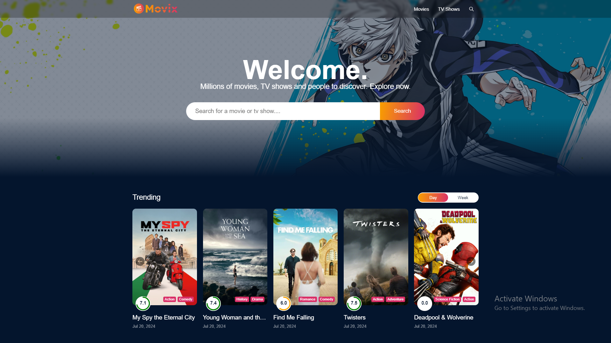
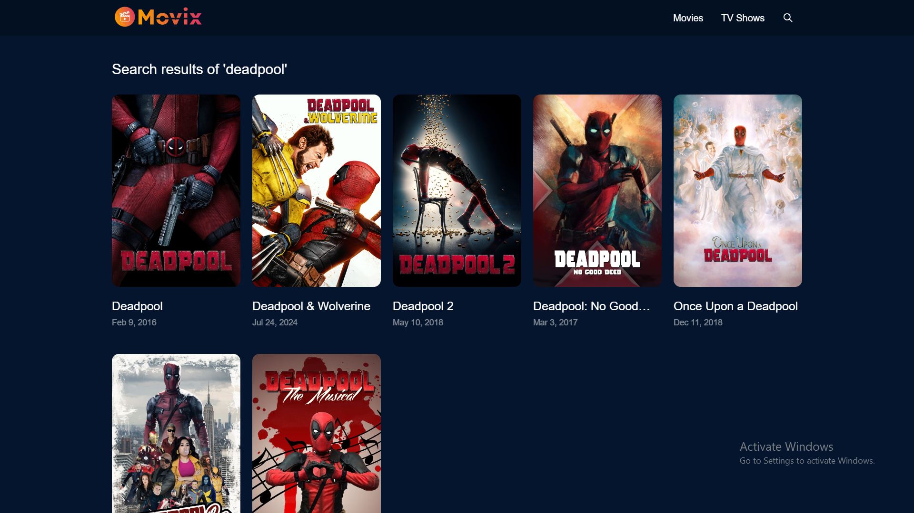
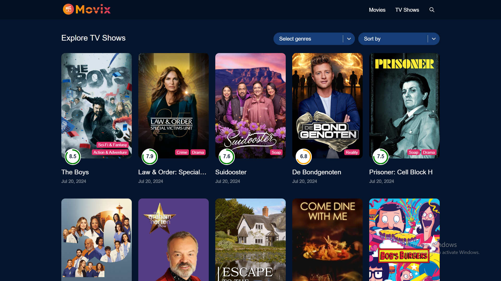
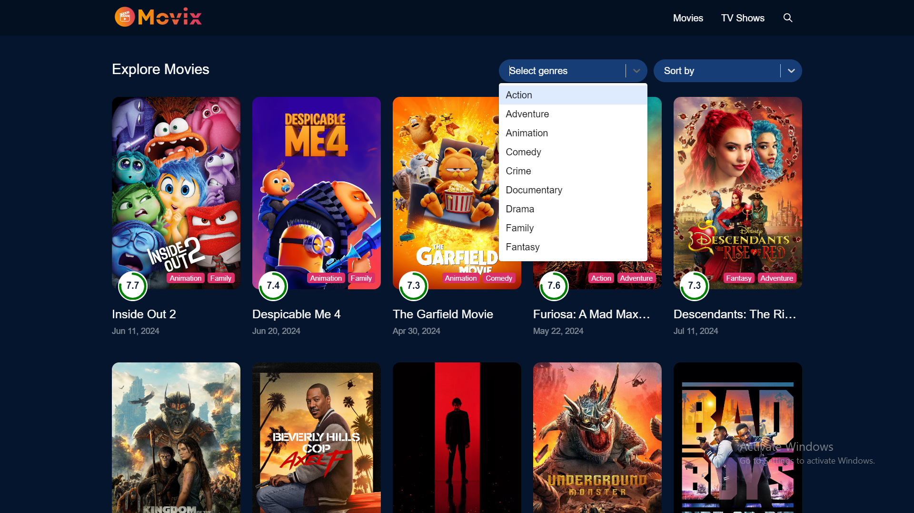
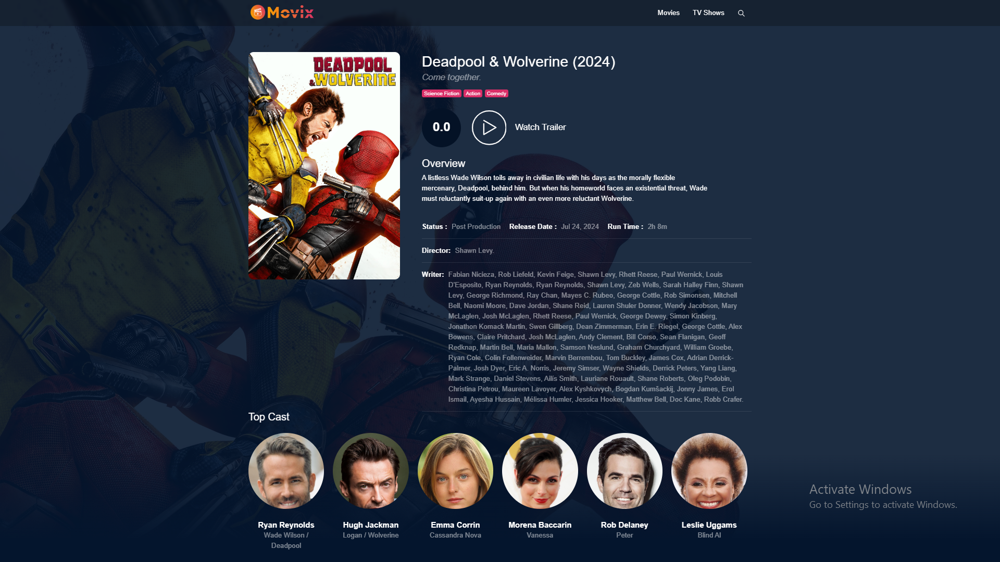
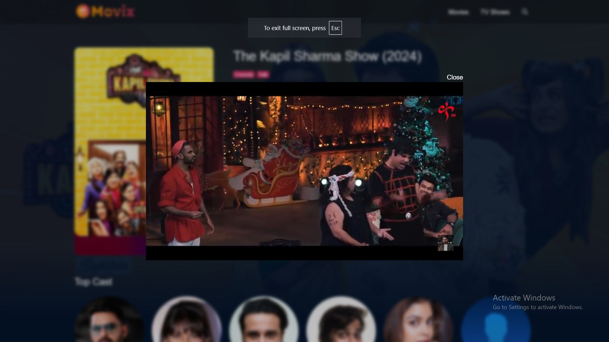

# MoviX Website Clone

<<<<<<< HEAD
Welcome to the Movie & TV Series Website Clone repository! This project aims to replicate the functionality of a popular streaming platform, offering a seamless browsing experience for movie enthusiasts and TV series buffs alike.

## Features
=======
This template provides a minimal setup to get React working in Vite with HMR and some ESLint rules.
Currently, two official plugins are available:
>>>>>>> d11f28f510036a9235988b96902dacaf708f55a5

### **Home Page:** Discover the latest movies and TV series.

### **Search Functionality:** Quickly find your favorite movies and TV series using our powerful search feature.

### **Sorting Options:** Sort listings by genres, popularity, release date, and more to discover content that matches your preferences.

  

### **Genre Filters:** Filter content by genres such as action, comedy, drama, thriller, and more to find exactly what you're in the mood for.

  

### **Movie Details:** View detailed information about a specific movie or TV series.

### **Watch Now:** Watch your favorite movies and TV series on live.

## Technologies Used

- **Frontend:** HTML, CSS, JavaScript (React.js)
- **Backend:** TMDB API

## Contributing

Contributions are welcome! If you have any suggestions, feature requests, or bug reports, please open an issue or submit a pull request.

## Acknowledgments

Special thanks to MoviX.com for inspiration and to the open-source community for their invaluable tools and libraries.

## Contact

For questions or feedback, please feel free to reach out at [nageshpawarpatil@gmail.com](mailto:nageshpawarpatil@gmail.com).

Enjoy exploring movies and TV series with our website clone!
